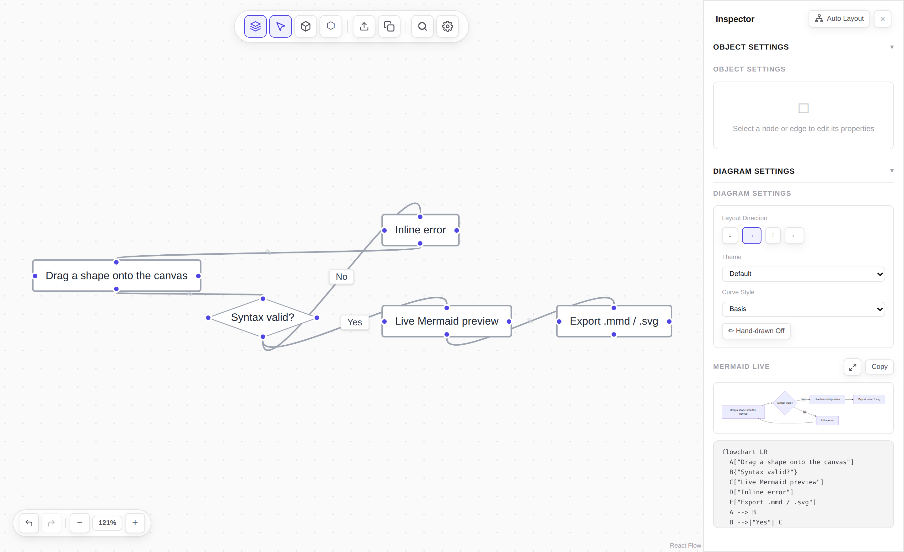
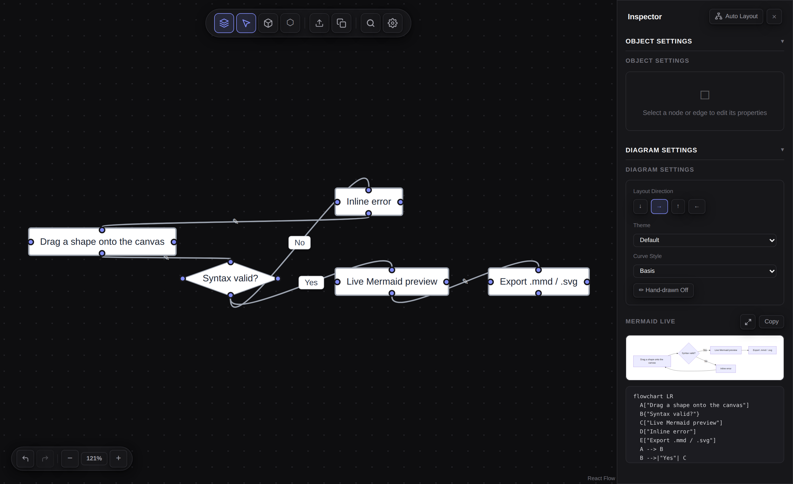

# Mermaid Visual Editor — Desktop

A visual drag-and-drop editor for [Mermaid.js](https://mermaid.js.org) flowcharts,
packaged as a Windows desktop app. Draw the diagram; the `.mmd` writes itself.

No account. No cloud. No server — not even a local one.

> **This is a fork.** The editor is the work of
> **[Saket Kattuboina](https://github.com/saketkattu)** —
> [saketkattu/mermaid-visual-editor](https://github.com/saketkattu/mermaid-visual-editor) (MIT).
> This fork adds an Electron desktop shell and a flat light/dark theme.
> **[Read the original README →](https://github.com/saketkattu/mermaid-visual-editor#readme)**
> (project background, the problem it solves, npm/npx usage, roadmap.)



<details>
<summary><b>Dark mode</b></summary>
<br>

</details>

---

## Download

**[Latest release →](https://github.com/Dreyia/mermaid-visual-editor/releases/latest)**

| File | Use it when |
|---|---|
| `MermaidVisualEditor-<version>-portable.exe` | You just want to run it. Nothing is installed. |
| `MermaidVisualEditor-<version>-setup.exe` | You want Start Menu and desktop shortcuts, and a normal uninstall entry. |
| `MermaidVisualEditor-<version>-win-x64.zip` | You want the unpacked app — unzip anywhere and run the `.exe` inside. |

Windows x64. The builds are **unsigned**, so SmartScreen shows *"Windows protected
your PC"* on first run — **More info → Run anyway**.

Prefer the browser? The original project is on npm and has a hosted demo — see the
[upstream README](https://github.com/saketkattu/mermaid-visual-editor#readme).

---

## What this iteration adds

### Runs as a desktop app

The Next.js static export is served over a custom `app://` scheme registered by the
Electron main process, instead of spawning the bundled `serve` on `localhost:3000`
the way [`bin/cli.js`](bin/cli.js) does. So there is no port to collide with, no
listening socket, and no browser tab. The scheme is registered `standard` + `secure`,
which keeps the page on a real origin with a secure context — that is what the
clipboard copy in the toolbar and command palette needs to keep working.

### Flat theme, light and dark

The original neumorphic styling — one grey field, embossed shadows on every control —
is replaced with a flat system built on semantic tokens. **Settings → Appearance →
System / Light / Dark**; *System* follows the OS theme and reacts to it live.

The diagram itself is deliberately left alone. Node fill, stroke, and text colours,
and the surface the Mermaid preview renders on, stay as they were in both themes —
they are serialised into the `.mmd`, so theming them would make what you see stop
matching what you export.

### One upstream fix

The **Import .mmd** dialog closed the instant you clicked anything inside it. The
modal is a sibling of the settings popover rather than a child, so every click in it
registered as "outside" and tore the popover — and the modal with it — down.
See [`components/SettingsPopover.tsx`](components/SettingsPopover.tsx).

---

## Build it yourself

```bash
git clone https://github.com/Dreyia/mermaid-visual-editor.git
cd mermaid-visual-editor
pnpm install

pnpm desktop      # next build && electron .   — the normal loop
pnpm desktop:run  # electron .                 — reuse an existing out/
pnpm dist         # next build && electron-builder --win  → dist/
pnpm dist:dir     # unpacked only, no installer

pnpm dev          # or just run it in a browser on :3000
```

**Requirements:** Node.js 18+, pnpm. `pnpm dist` downloads the Electron binary and
NSIS toolchain on first run.

Design rationale, the full file inventory, and a 33-step manual test checklist live in
**[DESKTOP.md](DESKTOP.md)**.

---

## Credits

**Mermaid Visual Editor** was created by
**[Saket Kattuboina](https://github.com/saketkattu)** and is released under the MIT
License. Everything that makes this a diagram editor is his: the React Flow canvas,
the Mermaid parser and serializer, the inspector, the command palette, the shape
system, the layout engine.

- Upstream repo: [saketkattu/mermaid-visual-editor](https://github.com/saketkattu/mermaid-visual-editor)
- Upstream README: [the full project write-up](https://github.com/saketkattu/mermaid-visual-editor#readme)
- Hosted demo: [mermaid-visual-editor-delta.vercel.app](https://mermaid-visual-editor-delta.vercel.app/)

This fork adds only:

| Path | What it is |
|---|---|
| `electron/` | Desktop shell and the `app://` static-file protocol |
| `electron-builder.yml`, `build/icon.ico` | Windows packaging |
| `lib/theme.ts`, `components/ThemeToggle.tsx` | Light/dark preference |
| `app/globals.css` + component edits | Token-based restyle |
| `DESKTOP.md` | Desktop build notes and test plan |

Built with [Mermaid.js](https://mermaid.js.org), [React Flow](https://reactflow.dev),
[Next.js](https://nextjs.org), [Zustand](https://zustand.docs.pmnd.rs) and
[Electron](https://www.electronjs.org).

---

## Contributing

Issues and PRs about the **desktop shell or the theme** belong here. Anything about
the editor itself is better raised
[upstream](https://github.com/saketkattu/mermaid-visual-editor/issues).

```bash
pnpm lint    # eslint
pnpm build   # production build → out/
```

See [CONTRIBUTING.md](CONTRIBUTING.md) and [SECURITY.md](SECURITY.md) — both carried
over from upstream.

---

## License

MIT — see [LICENSE](LICENSE). Copyright remains with the Mermaid Visual Editor
contributors; this fork adds to it under the same terms.
